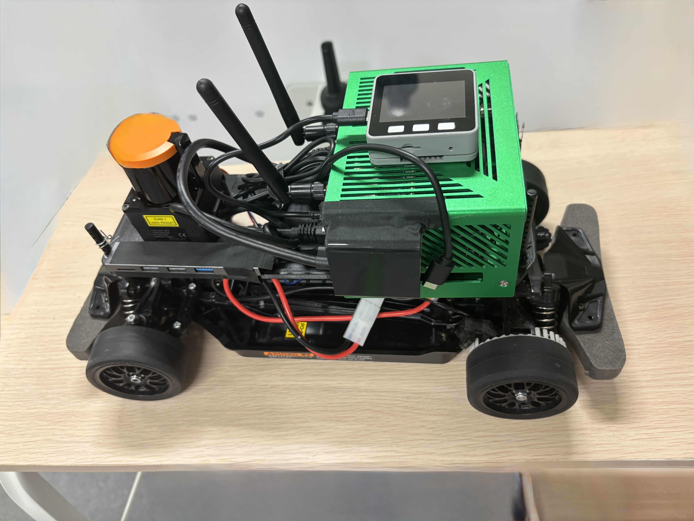
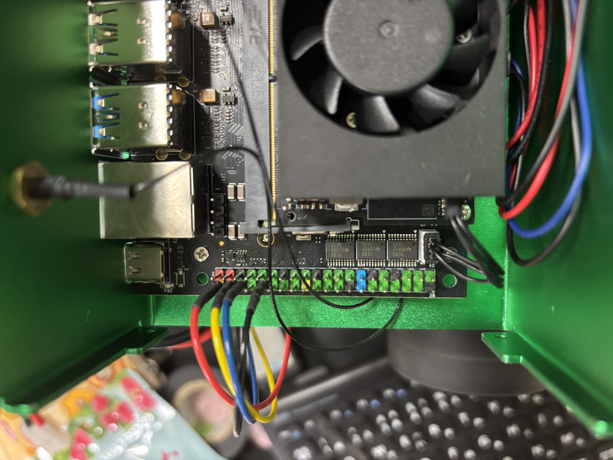
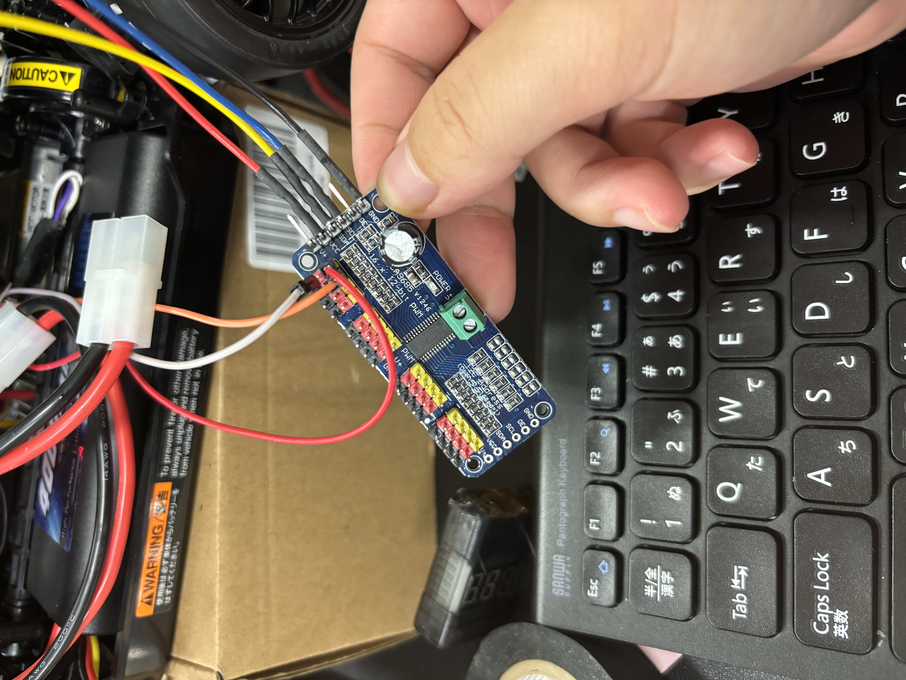
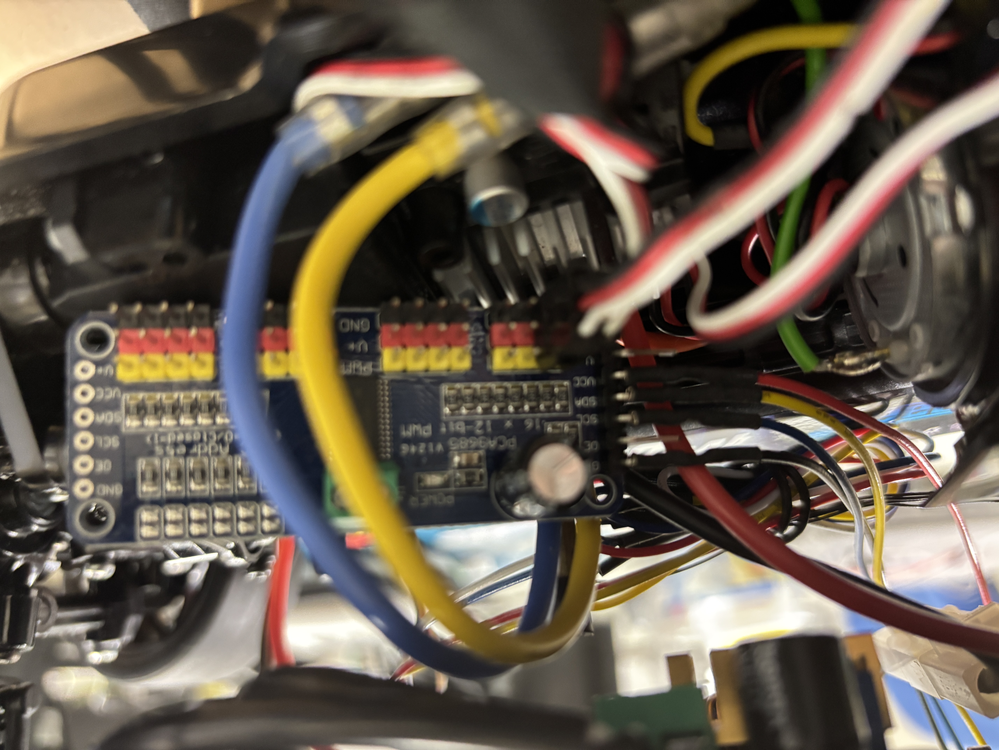

[🇯🇵 日本語](#日本語) | [🇺🇸 English](#english)

---

## English

# Hardware Build Guide

> 🚧 **Work in progress** — Assembly instructions, wiring diagrams, and STL files are being prepared. Content marked "Coming soon" will be added by the authors.

## Concept

MAGP uses a high-spec configuration relative to its mini car form factor — **NVIDIA Jetson Orin NX** for onboard AI compute and **Hokuyo UST-10LX** for 2D LiDAR sensing. This makes the platform capable of genuine research workloads (real-time model inference, SLAM, data collection) on a 1/10-scale RC car chassis.



## Bill of Materials

| # | Component | Model / Link | Notes |
|---|-----------|-------------|-------|
| 1 | RC car chassis | [Tamiya TT-02](https://www.tamiya.com/cms/english/rc/rcmanual/tt02.pdf) | 1/10-scale, belt-driven 4WD. Includes ESC and steering servo. |
| 2 | 2D LiDAR | Hokuyo UST-10LX | Ethernet, 270°, 40 m range. Ethernet cable included. |
| 3 | SBC | NVIDIA Jetson Orin NX 16GB | 157 TOPS, 8-core Cortex-A78AE, 16GB LPDDR5, GbE × 1 |
| 4 | SBC case | [Amazon](https://amzn.asia/d/0bSVL3AZ) | Any case that fits the chassis |
| 5 | PWM driver | PCA9685 breakout board | I2C, 16-ch, 50 Hz |
| 6 | LiPo battery | [7.4V 2S LiPo](https://amzn.asia/d/3W8HEnf) | Main power source |
| 6a | LiPo balance charger | Any 2S–3S LiPo balance charger | For charging the 7.4V 2S battery |
| 7 | DC-DC boost converter | [7.4V → 12V](https://amzn.asia/d/dPUERnJ) | Powers LiDAR and Jetson |
| 8 | Tamiya plug | [Tamiya connector](https://amzn.asia/d/3aU40sA) | Battery connector |
| 9 | DC barrel jack pigtail cable | DC 5.5mm × 2.5mm (verify your carrier board) | One end: DC plug for Jetson power jack. Other end: bare wire to DC-DC converter output. Accepts 9–20V. |
| 10 | Joystick | PS3 / PS4 | USB or Bluetooth |
| 11 | Display | M5Stack Core2 | Optional, USB serial to Jetson |

> **Mounting:** All parts except the PCA9685 are mounted using 3D-printed brackets. STL files will be provided in this repository.

---

## Step 0 — Prepare Parts

Gather all components listed in the BOM above. Confirm that:
- The LiPo battery is charged.
- The TT-02 kit contents are complete (motor, ESC, servo, chassis parts).
- The PCA9685 is soldered (header pins and terminal block).

---

## Step 1 — Assemble the RC Car

Assemble the Tamiya TT-02 chassis following the official manual:
[https://www.tamiya.com/cms/english/rc/rcmanual/tt02.pdf](https://www.tamiya.com/cms/english/rc/rcmanual/tt02.pdf)

Complete the standard assembly up through mounting the ESC and servo. Do **not** mount a receiver — the PCA9685 will take its place.

---

## Step 2 — Power System Wiring

The power topology is as follows:

```
[7.4V LiPo] (Tamiya plug)
      │
      ├──────────────────────────► ESC (RC car main power)
      │
      └──► [DC-DC Boost Converter]  7.4V → 12V
                  │
                  ├──────────────► Hokuyo UST-10LX  (12V)
                  │
                  └──────────────► Jetson Orin NX   (12V, via DC barrel jack pigtail)
```

1. Connect the LiPo battery (Tamiya plug) to a splitter cable.
2. Route one branch to the ESC's battery input (the existing Tamiya connector on the TT-02).
3. Route the other branch to the DC-DC boost converter input. Set the output to **12V**.
4. From the boost converter output, split again:
   - One branch to the LiDAR power input.
   - One branch to the Jetson via the DC barrel jack pigtail cable.

> Verify polarity at every connection before powering on.

---

## Step 3 — Mount and Wire Jetson and LiDAR

1. Mount the Jetson Orin NX (in its case) onto the chassis using the 3D-printed bracket.
2. Mount the UST-10LX on the front of the chassis using the 3D-printed bracket.
3. Connect the LiDAR and Jetson with the **Ethernet cable** (included with UST-10LX).
   - Configure the Jetson's Ethernet interface with a static IP on the same subnet as the UST-10LX (default: `192.168.0.10`).

---

## Step 4 — Install and Wire the PCA9685

Mount the PCA9685 board on the chassis.

**I2C connection (Jetson → PCA9685):**

| PCA9685 pin | Jetson GPIO header pin |
|-------------|----------------------|
| VCC | 3.3V |
| GND | GND |
| SDA | SDA (I2C) |
| SCL | SCL (I2C) |



**PWM output (PCA9685 → RC car):**

| PCA9685 channel | Connected to |
|-----------------|-------------|
| CH0 | ESC signal input (throttle) |
| CH1 | Steering servo signal input |

The ESC provides a 5V BEC output through the servo signal connector, which powers the servo rail (V+) of the PCA9685.




---

## Full Wiring Overview

```
[7.4V LiPo]
    ├── ESC ──► Motor
    └── DC-DC Boost (12V)
          ├── UST-10LX ──(Ethernet)──► Jetson Orin NX
          └── Jetson Orin NX (DC barrel jack)
                ├── (I2C) ──► PCA9685
                │                ├── CH0 ──► ESC signal (throttle)
                │                └── CH1 ──► Servo signal (steering)
                ├── (USB/BT) ──► PS3/PS4 Joystick
                └── (USB serial) ──► M5Stack Core2 (optional)
```

---
---

## 日本語

# ハードウェアビルドガイド

> 🚧 **作成中** — 組み立て手順・配線図・STLファイルは準備中です。

## コンセプト

MAGPは、1/10スケールのミニカーサイズながら研究用途として十分なスペックを持つことを特徴としています。**NVIDIA Jetson Orin NX** による高い計算能力と **北陽電機 UST-10LX** の高精度LiDARにより、リアルタイム推論・SLAM・データ収集を実機上でこなせる構成です。


## 部品リスト

| # | 部品 | 型番 / リンク | 備考 |
|---|------|-------------|------|
| 1 | RCカーシャーシ | [Tamiya TT-02](https://www.tamiya.com/cms/english/rc/rcmanual/tt02.pdf) | 1/10スケール、ベルト駆動4WD。ESC・ステアリングサーボ付属。 |
| 2 | 2D LiDAR | 北陽電機 UST-10LX | Ethernet接続、270°、測定距離40 m。Ethernetケーブル付属。 |
| 3 | SBC | NVIDIA Jetson Orin NX 16GB | 157 TOPS、8コア Cortex-A78AE、16GB LPDDR5、GbE × 1 |
| 4 | SBCケース | [Amazon](https://amzn.asia/d/0bSVL3AZ) | シャーシに収まるものであれば何でもよい |
| 5 | PWMドライバー | PCA9685ブレークアウトボード | I2C、16ch、50 Hz |
| 6 | リポバッテリー | [7.4V 2S LiPo](https://amzn.asia/d/3W8HEnf) | メイン電源 |
| 6a | リポバッテリー充電器 | 2S〜3S対応リポバランス充電器 | 7.4V 2S バッテリーの充電用 |
| 7 | DC-DC昇圧コンバータ | [7.4V → 12V](https://amzn.asia/d/dPUERnJ) | LiDARとJetsonに給電 |
| 8 | タミヤプラグ | [タミヤコネクタ](https://amzn.asia/d/3aU40sA) | バッテリーコネクタ |
| 9 | DCプラグ付きピグテールケーブル | DC 5.5mm × 2.5mm（キャリアボードで要確認） | 片側：JetsonのDC電源ジャック用プラグ（9〜20V 入力）。もう片側：DC-DCコンバータ出力端子に接続する裸線。 |
| 10 | ジョイスティック | PS3 / PS4 | USBまたはBluetooth |
| 11 | ディスプレイ | M5Stack Core2 | オプション、JetsonにUSBシリアル接続 |

> **固定方法：** PCA9685以外の各部品は3Dプリンターで印刷したブラケットで固定します。STLファイルはこのリポジトリに追加予定です。

---

## ステップ 0 — 部品の準備

上記の部品リストを揃えます。以下を確認してください：
- リポバッテリーが充電されていること
- TT-02キットの内容物が揃っていること（モーター、ESC、サーボ、シャーシパーツ）
- PCA9685のハンダ付けが完了していること（ピンヘッダとターミナルブロック）

---

## ステップ 1 — RCカーの組み立て

Tamiya TT-02の公式マニュアルに従ってシャーシを組み立てます：
[https://www.tamiya.com/cms/english/rc/rcmanual/tt02.pdf](https://www.tamiya.com/cms/english/rc/rcmanual/tt02.pdf)

ESCとサーボを取り付けるところまで標準組み立てを完了させます。**受信機は取り付けない**でください（代わりにPCA9685を使用します）。

---

## ステップ 2 — 電源系統の固定と配線

電源系統のトポロジーは以下の通りです：

```
[7.4Vリポバッテリー]（タミヤプラグ）
      │
      ├──────────────────────────► ESC（RCカー本体電源）
      │
      └──► [DC-DC昇圧コンバータ]  7.4V → 12V
                  │
                  ├──────────────► 北陽電機 UST-10LX  (12V)
                  │
                  └──────────────► Jetson Orin NX     (12V、DCプラグ経由)
```

1. リポバッテリー（タミヤプラグ）を分岐ケーブルに接続します。
2. 一方をTT-02のESCバッテリー入力（既存のタミヤコネクタ）に接続します。
3. もう一方をDC-DC昇圧コンバータの入力に接続し、出力を **12V** に設定します。
4. 昇圧コンバータの出力をさらに分岐します：
   - 一方をLiDARの電源入力に接続します。
   - もう一方をDCプラグ付きピグテールケーブルを介してJetsonの電源ジャックに接続します。

> 各接続の極性を必ず確認してから通電してください。

---

## ステップ 3 — JetsonとLiDARの固定と配線

1. Jetson Orin NX（ケース入り）を3Dプリント製ブラケットでシャーシに固定します。
2. UST-10LXを3Dプリント製ブラケットでシャーシ前部に固定します。
3. LiDARとJetsonをUST-10LXに**付属のEthernetケーブル**で直結します。
   - JetsonのEthernetインターフェイスをUST-10LXと同一サブネットの静的IPに設定してください（UST-10LXデフォルト: `192.168.0.10`）。

---

## ステップ 4 — モータードライバーの取り付けと配線

PCA9685ボードをシャーシに取り付けます。

**I2C接続（Jetson → PCA9685）：**

| PCA9685ピン | Jetson GPIOヘッダピン |
|-------------|----------------------|
| VCC | 3.3V |
| GND | GND |
| SDA | SDA (I2C) |
| SCL | SCL (I2C) |


**PWM出力（PCA9685 → RCカー）：**

| PCA9685チャンネル | 接続先 |
|------------------|--------|
| CH0 | ESC信号入力（スロットル） |
| CH1 | ステアリングサーボ信号入力 |

ESCのBEC出力（サーボコネクタ経由の5V）がPCA9685のサーボレール（V+）に給電します。


---

## 配線全体図

```
[7.4Vリポバッテリー]
    ├── ESC ──► モーター
    └── DC-DC昇圧（12V）
          ├── UST-10LX ──(Ethernet)──► Jetson Orin NX
          └── Jetson Orin NX（DCプラグ）
                ├── (I2C) ──► PCA9685
                │                ├── CH0 ──► ESC信号（スロットル）
                │                └── CH1 ──► サーボ信号（ステアリング）
                ├── (USB/BT) ──► PS3/PS4ジョイスティック
                └── (USBシリアル) ──► M5Stack Core2（オプション）
```
